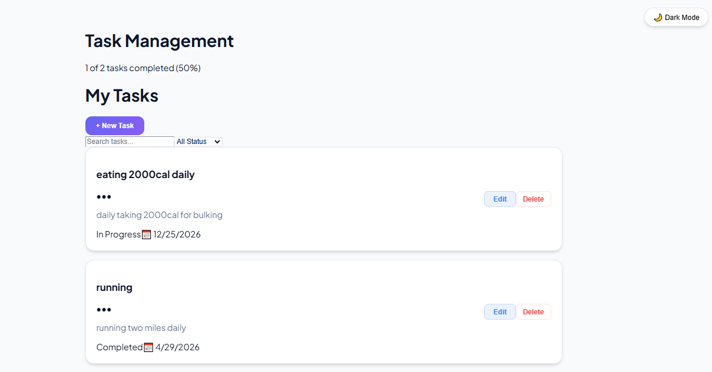
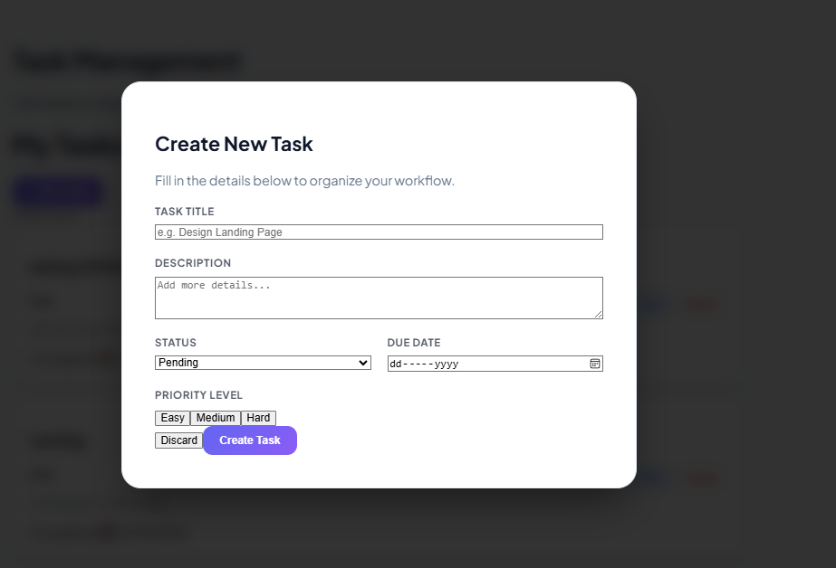
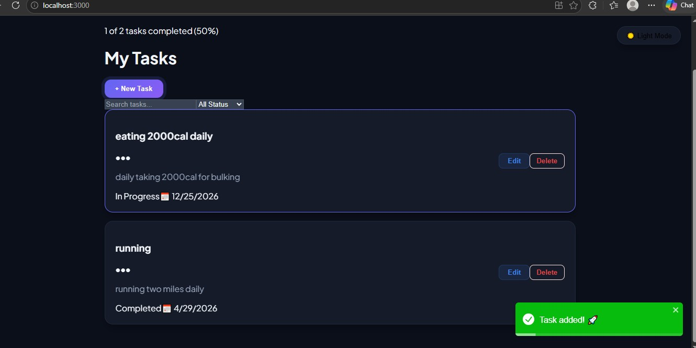
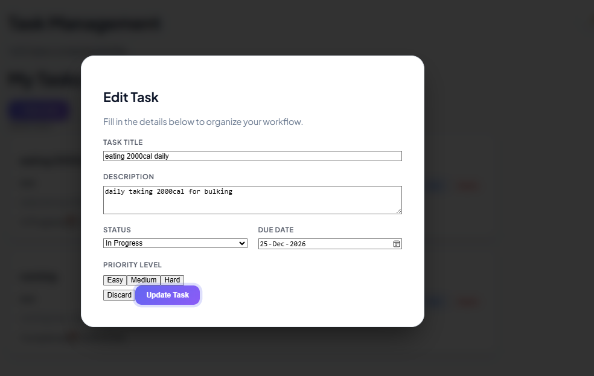

# 📝 Task Management System
**Developed during my internship at Developer Hub**  
**Developed by:** AbdulGhaffar-Dev-tech

## 📖 Project Description
A full-stack MERN application that allows users to create, view, and delete tasks in real-time. This project focuses on CRUD operations and clean API integration.

## 🚀 Tech Stack
*   **Frontend:** React.js
*   **Backend:** Node.js & Express.js
*   **Database:** MongoDB

## ⚙️ Setup Instructions
To run this project locally, follow these steps:

1. **Backend Setup:**
   ```bash
   cd "INTERNSHIP PROJ"
   npm install
   npm start 

2. **Frontend Setup:**
   ```bash
   cd task-frontend
   npm install
   npm run dev

## 🔌 API Endpoints
* **GET** `/api/tasks` — Retrieves all tasks.
* **POST** `/api/tasks` — Adds a new task to the database.
* **DELETE** `/api/tasks/:id` — Removes a specific task.

## 📸 Screenshots

### Main Dashboard


### Adding a New Task


### Dark Mode


### Edit Task



*The dashboard displays the list of tasks fetched from MongoDB and allows for real-time task management.*