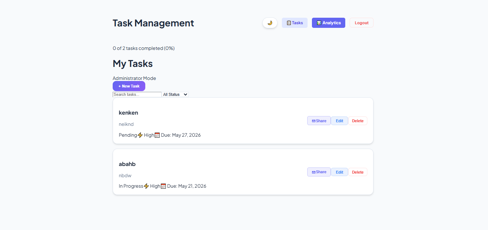
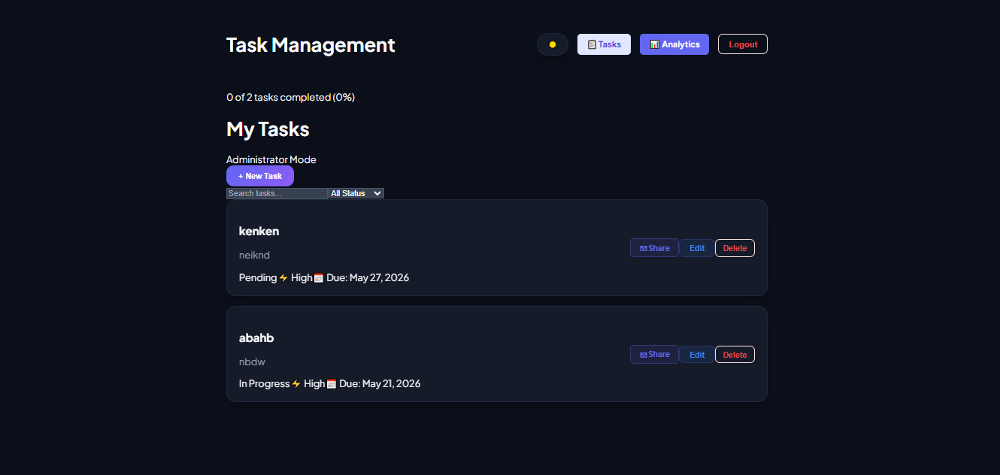
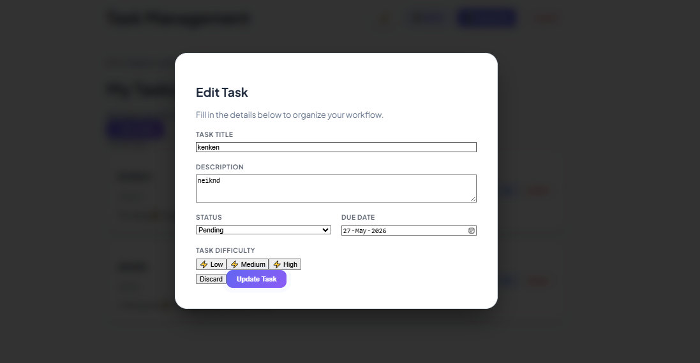
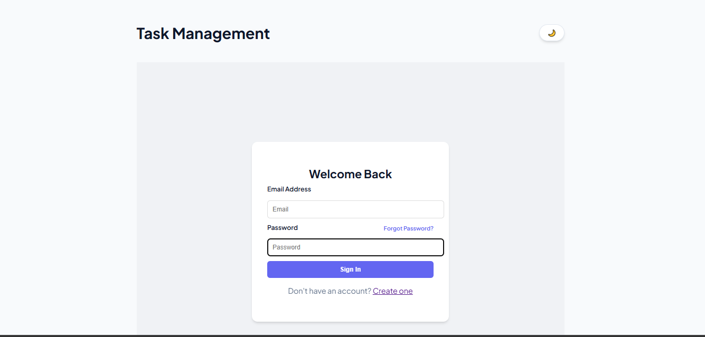
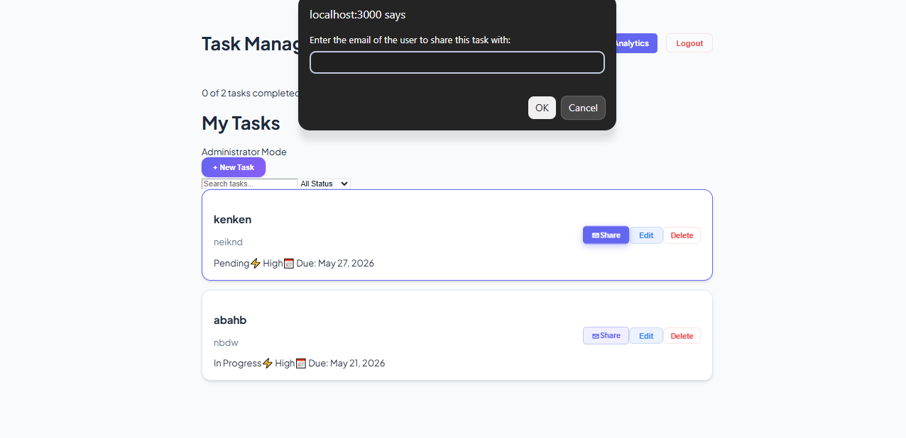
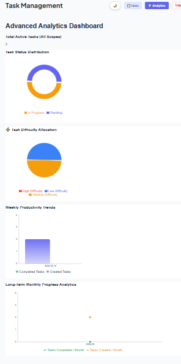
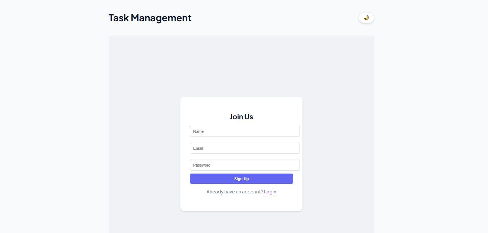
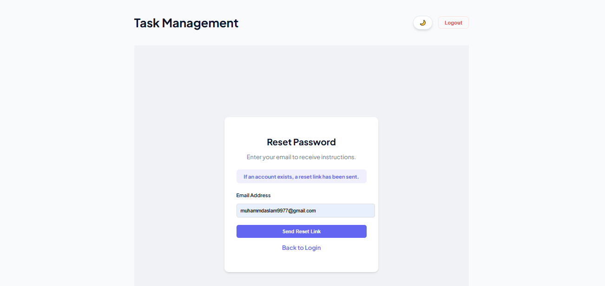
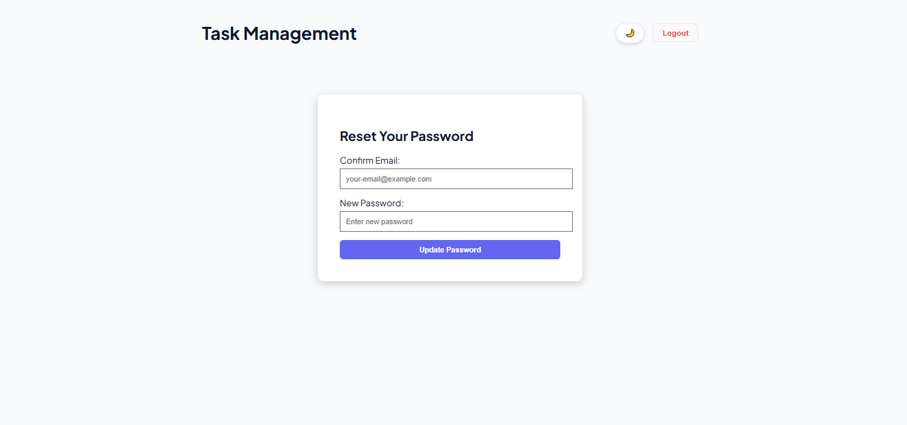

# 📝 Task Management System
**Developed during my internship at Developer Hub corporation** **Developed by:** AbdulGhaffar-Dev-tech

## 📖 Project Description
A full-stack MERN application that allows users to manage tasks in real-time. This project has evolved from a basic CRUD app into a secure, multi-user collaboration platform featuring real-time notifications and role-based access control.

## ✨ New Features & Enhancements
* ** User Authentication:** Secure Signup and Login system using JWT (JSON Web Tokens).
* ** Role-Based Access (RBAC):** Distinction between Admin and User roles.
* ** Task Collaboration:** Admins can share specific tasks with other users via email.
* ** Real-Time Notifications:** Integrated Socket.io for instant alerts when tasks are shared or status updates occur.
* ** Task Ownership:** Secure logic ensuring users only manage tasks they own or are authorized to collaborate on.
* ** 📅 Due Date Tracking:** Integrated an end-to-end task validation pipeline to assign, store, and display clean target dates seamlessly.
* ** Password Recovery:** Integrated Nodemailer for "Forgot Password" and "Reset Password" functionality.
* ** Progress Tracking:** Dynamic progress bar calculating completion percentage in real-time.
* ** Theme Management:** Persistent Dark/Light mode toggle.

* **🚀 Unified Production Build:** Configured for Express v5 to serve static frontend production build files natively on a single live URL link.
## 🚀 Tech Stack
* **Frontend:** React.js, Socket.io-client, Tailwind CSS
* **Backend:** Node.js & Express.js
* **Real-Time:** Socket.io
* **Database:** MongoDB (via Mongoose)
* **Authentication:** JWT & Bcrypt.js
* **Mail Service:** Nodemailer

## ⚙️ Setup Instructions
To run this project locally, follow these steps:

1. **Backend Setup:**
   ```bash
   # Navigate to backend directory
   cd "INTERNSHIP PROJ"
   # Create a .env file and add:
   # MONGO_URI, JWT_SECRET, EMAIL_USER, and EMAIL_PASS
   npm install
   npm start

2. **Frontend Setup:**
   ```bash
   # Navigate to frontend directory
   cd task-frontend
   npm install
   npm run dev

## 🔌 API Endpoints
* Authentication
* POST /api/auth/login — Authenticate user & return token.

* POST /api/auth/signup — Register a new user.

* Tasks & Collaboration
* GET /api/tasks — Retrieves tasks (Owned & Shared) for the authenticated user.

* POST /api/tasks — Adds a new task linked to the creator.

* PUT /api/tasks/:id — Updates an existing task (Authorized for Owner/Collaborator).

* PUT /api/tasks/:id/share — (Admin Only) Shares a task with another user.

* DELETE /api/tasks/:id — (Owner Only) Removes a specific task.

## 📅 Due Date Architecture

The framework handles dates through a safe validation-secure pathway, moving from frontend input directly to database normalization:

* **Frontend Engine (`TaskForm.js` & `TaskList.js`):** Intercepts standard calendar values through an input module. Long ISO-timestamp formats (`2026-05-17T00:00:00.000Z`) are stripped to `YYYY-MM-DD` values for input component reading. Dashboards cleanly output readable strings using:  
  `new Date(task.dueDate).toLocaleDateString('en-US', { month: 'short', day: 'numeric', year: 'numeric' })`
* **Route Validation Boundary (`taskRoutes.js`):** Leverages `express-validator` middleware rules to catch payloads before hitting standard model modifications. It drops empty string anomalies by converting them into unified `null` representations.

### 🗃️ Database Schema Matrix
* Data models adhere to the following Mongoose architectural standards:

## 📌 Title (String)

* Rules: Required, Trimmed

* Role: The core headline or name of the task assignment.

## 📝 Description (String)

* Rules: Optional

* Role: Provides deeper details, requirements, and context notes.

## 🔄 Status (String)

* Rules: Enum: ['Pending', 'In Progress', 'Completed'] | Default: 'Pending'

* Role: Tracks the current progress of the item within the lifecycle.

## ⚡ Difficulty (String)

*  Rules: Enum: ['Low', 'Medium', 'High'] | Default: 'Low'

* Role: Measures operational urgency and resource consumption tier.

## 📅 Due Date (Date)

* Rules: Optional, ISO8601 Verified

* Role: Sets the concrete calendar deadline for task completion.

## 🔑 Owner (ObjectId)

* Rules: Required, Ref: 'User'

* Role: Maps absolute data ownership directly to the creator's ID.

## 👥 Shared With (Array)

* Rules: Array of ObjectIds, Ref: 'User'

* Role: Manages collaborative permission arrays for team access.

## ⏱️ Timestamps (Boolean)

* Rules: { timestamps: true }

* Role: Automatically injects and handles createdAt and updatedAt logs.

## 📸 Project Showcase

### 🔔 Real-Time Collaboration
* When an Admin shares a task, the user receives an instant notification without refreshing the page.

## 📸 Screenshots

### Main Dashboard


### Adding a New Task


### Dark Mode


### Edit Task


### Login Page


### share task


### Analytics


### Signup Page


### Forgot


### Reset


*The dashboard displays the list of tasks fetched from MongoDB and allows for real-time task management.*